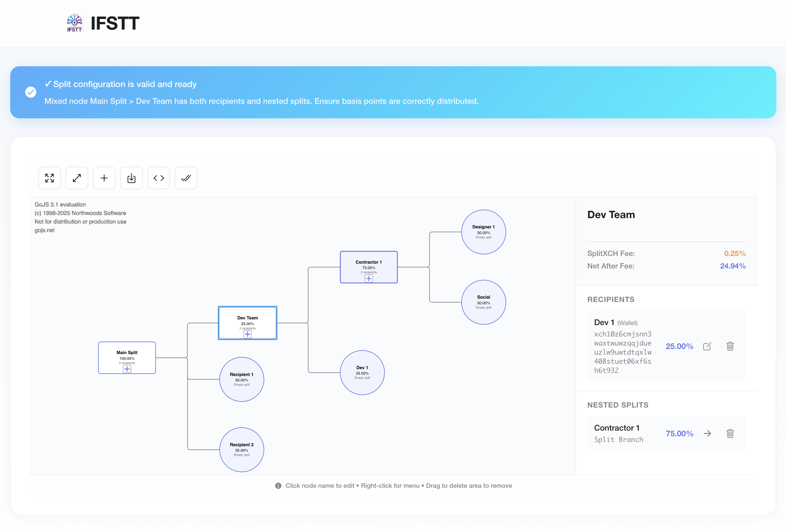

# IFSTT - IF Split Then That

<div align="center">

**A visual tool for creating complex, infinitely branching SplitXCH royalty distribution systems**

[](https://opensource.org/licenses/MIT)
[](https://angular.io/)
[](https://ionicframework.com/)

*Build beautiful split trees • Calculate basis points • Generate SplitXCH addresses*

</div>

---

## 🎯 Overview

**IFSTT** (IF Split Then That) is an open-source visual builder for creating sophisticated royalty distribution systems using [SplitXCH](https://splitxch.com). Perfect for NFT creators, artists, developers, and teams who need to split royalties across multiple recipients with complex, nested structures.

### Key Features

✨ **Visual Split Tree Builder**
- Interactive GoJS-powered diagram interface
- Drag-and-drop node management
- Real-time basis points validation
- Apple-quality, responsive design

🔗 **Infinitely Nested Splits**
- Create splits within splits (no depth limit)
- Support for 128+ recipients via cascading structures
- SplitXCH nodes and fixed wallet addresses

📊 **Basis Points System**
- Precise percentage calculations (1 bp = 0.01%)
- Automatic fee calculation and display
- Real-time validation ensuring totals = 10,000 bp (100%)

💾 **Export & Finalize**
- Export to JSON format
- Generate SplitXCH addresses via API
- Download finalized split configurations

🎨 **Beautiful UI/UX**
- Clean, modern interface
- Visual feedback for empty addresses
- Contextual menus and shortcuts
- Sidebar details panel

---

## 📸 Screenshots

<div align="center">



*IFSTT - Visual Split Tree Builder Interface*

</div>

---

## 🚀 Quick Start

### Prerequisites

- **Node.js** 16+ and npm
- **Ionic CLI** (optional, for advanced usage)

```bash
npm install -g @ionic/cli
```

### Installation

1. **Clone the repository**
   ```bash
   git clone https://github.com/Koba42Corp/splitxch-builder.git
   cd splitxch-builder/client
   ```

2. **Install dependencies**
   ```bash
   npm install
   ```

3. **Start the development server**
   ```bash
   npm start
   # or
   ionic serve
   ```

4. **Build for production**
   ```bash
   npm run build
   ```
   The built files will be in the `docs/` directory (ready for GitHub Pages).

---

## 📖 Usage Guide

### Creating Your First Split

1. **Start with the default tree**
   - When you open IFSTT, you'll see a root "Main Split" node with two default recipients

2. **Add recipients**
   - Click on a SplitXCH node to select it
   - Click the "+" button or right-click and select "Add Recipient"
   - Choose between:
     - **Fixed Wallet**: Enter an existing XCH wallet address
     - **New Split**: Create a nested split branch

3. **Edit recipient details**
   - Click on a recipient in the sidebar to edit
   - Update name, address, and percentage
   - Percentages must sum to 100% for each split

4. **Validate your tree**
   - The status banner at the top shows validation status
   - All wallet addresses must be filled
   - All basis points must sum correctly

5. **Finalize and generate addresses**
   - Click "Finalize Blueprint" when ready
   - IFSTT will call the SplitXCH API to create addresses
   - Download the finalized tree as JSON

### Understanding Basis Points

- **1 basis point (bp) = 0.01%**
- **10,000 basis points = 100%**
- SplitXCH charges a **150 bps (1.5%) fee** per split
- The UI automatically accounts for fees in calculations

### Visual Indicators

- 🔴 **Red border**: Wallet node with empty address
- 🔵 **Blue border**: Selected node
- ⬜ **Rectangle**: SplitXCH node (can have children)
- ⭕ **Circle**: Wallet/Recipient node (leaf node)

---

## 🏗️ Architecture

### Project Structure

```
client/
├── src/
│   ├── app/
│   │   ├── models/
│   │   │   └── split-tree.models.ts    # Data models
│   │   ├── services/
│   │   │   ├── split-tree.service.ts   # Tree logic & validation
│   │   │   └── splitxch-api.service.ts # SplitXCH API integration
│   │   ├── split-builder/
│   │   │   ├── split-builder.page.ts   # Main component
│   │   │   └── components/
│   │   │       └── split-diagram/      # GoJS diagram component
│   │   └── ...
│   └── environments/
│       ├── environment.ts              # Dev config
│       └── environment.prod.ts         # Prod config
└── docs/                               # Build output (for GitHub Pages)
```

### Key Components

- **SplitTreeService**: Core business logic for tree operations
- **SplitXCHApiService**: Integration with SplitXCH compute API
- **SplitDiagramComponent**: GoJS-based visual diagram
- **SplitBuilderPage**: Main UI and state management

---

## 🔌 API Integration

IFSTT integrates with the [SplitXCH Compute API](https://splitxch.com):

### Endpoints Used

- `POST /api/compute/fast` - Create a new split
- `GET /api/compute/{id}` - Check compute status (future use)

### Configuration

Update the API URL in `src/environments/environment.ts`:

```typescript
export const environment = {
  production: false,
  splitXCHApiUrl: 'https://splitxch.com/api',
};
```

### API Request Format

```json
{
  "recipients": [
    {
      "name": "Recipient Name",
      "address": "xch1...",
      "points": 9850,
      "id": 1
    }
  ]
}
```

**Note**: The API automatically adds a 150 bps (1.5%) fee. Recipient points should sum to 9,850, which the code handles automatically.

---

## 🧪 Development

### Running Tests

```bash
npm test
```

### Code Style

The project uses:
- **TypeScript** for type safety
- **Angular** for framework
- **Ionic** for UI components
- **GoJS** for diagram visualization

### Adding Features

1. Fork the repository
2. Create a feature branch (`git checkout -b feature/amazing-feature`)
3. Make your changes
4. Test thoroughly
5. Commit your changes (`git commit -m 'Add amazing feature'`)
6. Push to the branch (`git push origin feature/amazing-feature`)
7. Open a Pull Request

---

## 🤝 Contributing

Contributions are welcome! Please feel free to submit a Pull Request.

### Areas for Contribution

- 🐛 Bug fixes
- ✨ New features
- 📚 Documentation improvements
- 🎨 UI/UX enhancements
- ⚡ Performance optimizations
- 🧪 Test coverage

Please read our [Contributing Guidelines](CONTRIBUTING.md) (coming soon) for details on our code of conduct and the process for submitting pull requests.

---

## 📝 License

This project is licensed under the MIT License - see the [LICENSE](LICENSE) file for details.

---

## 🙏 Acknowledgments

- [SplitXCH](https://splitxch.com) for the royalty splitting protocol
- [GoJS](https://gojs.net/) for the excellent diagramming library
- [Ionic](https://ionicframework.com/) for the mobile-first framework
- [Angular](https://angular.io/) for the robust application framework

---

## 📧 Support

- **Issues**: [GitHub Issues](https://github.com/Koba42Corp/splitxch-builder/issues)
- **Discussions**: [GitHub Discussions](https://github.com/Koba42Corp/splitxch-builder/discussions)

---

## 🌟 Star History

If you find IFSTT useful, please consider giving it a ⭐ on GitHub!

---

<div align="center">

**Built with ❤️ by the open-source community**

[Website](https://koba42corp.github.io/splitxch-builder) • [Documentation](#) • [Changelog](#)

</div>

